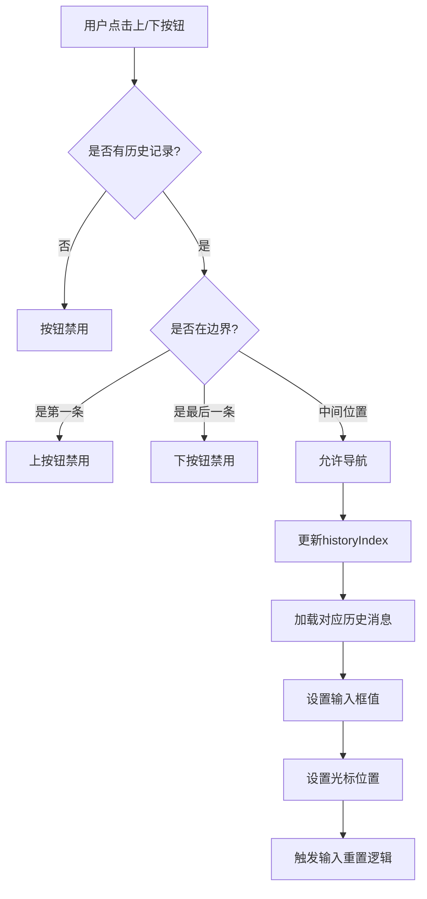

# 可视上下按钮功能设计方案

## 概述

设计可视上下按钮功能，用于在对话历史中导航用户提问。该功能将集成到现有的ChatTextArea组件中，提供直观的UI按钮来替代键盘导航。

## 现有架构分析

### 当前历史导航机制

1. **usePromptHistory Hook**

    - 使用上下箭头键进行导航
    - 支持两种历史源：对话消息和任务历史
    - 状态管理：historyIndex, tempInput, promptHistory
    - 边界处理：第一条/最后一条消息的禁用状态

2. **导航逻辑**
    - 识别用户消息类型：`user_feedback`
    - 智能导航：仅在光标位于行首时响应
    - 状态重置：用户输入时重置导航状态

## 设计方案

### 1. 按钮UI设计和位置规划

#### 按钮组件结构

```typescript
interface PromptHistoryButtonsProps {
	onNavigateUp: () => void
	onNavigateDown: () => void
	canNavigateUp: boolean
	canNavigateDown: boolean
	isVisible: boolean
}
```

#### 位置设计

- **位置**：位于输入框右侧，与发送按钮相邻
- **布局**：垂直排列，向上按钮在上，向下按钮在下
- **样式**：使用现有按钮样式，保持视觉一致性
- **响应式**：在移动设备上调整按钮大小

#### 视觉设计

- **图标**：使用Lucide React的ChevronUp/ChevronDown图标
- **状态指示**：
    - 可用时：正常透明度
    - 不可用时：降低透明度，禁用交互
    - 悬停时：高亮显示
- **尺寸**：28x28px，与现有按钮保持一致

### 2. 对话历史导航的状态管理机制

#### 集成现有usePromptHistory

- 复用现有的历史数据和导航逻辑
- 扩展hook以支持按钮导航
- 保持键盘和按钮导航的一致性

#### 状态扩展

```typescript
interface ExtendedPromptHistoryReturn extends UsePromptHistoryReturn {
	canNavigateUp: boolean
	canNavigateDown: boolean
	navigateUp: () => void
	navigateDown: () => void
}
```

#### 状态同步

- 按钮状态与键盘导航状态完全同步
- 实时更新可用性指示
- 保持tempInput和historyIndex的一致性

### 3. 与现有输入框的集成方式

#### ChatTextArea集成

- 在现有按钮区域添加历史导航按钮组
- 保持现有布局结构不变
- 使用条件渲染控制按钮显示

#### 布局调整

```jsx
{
	/* 现有发送按钮区域 */
}
;<div className="absolute bottom-2 right-2 z-30">
	{/* 历史导航按钮 */}
	<PromptHistoryButtons
		onNavigateUp={handleNavigateUp}
		onNavigateDown={handleNavigateDown}
		canNavigateUp={canNavigateUp}
		canNavigateDown={canNavigateDown}
		isVisible={hasHistory}
	/>

	{/* 发送按钮 */}
	<StandardTooltip content={t("chat:sendMessage")}>
		<button onClick={onSend}>
			<SendHorizontal className="w-4 h-4" />
		</button>
	</StandardTooltip>
</div>
```

#### 事件处理集成

- 按钮点击事件与键盘事件使用相同处理逻辑
- 保持光标位置管理一致性
- 支持组合操作（按钮+键盘）

### 4. 导航逻辑

#### 消息识别和加载

- **用户消息识别**：通过`message.say === "user_feedback"`识别
- **历史构建**：优先使用对话消息，其次使用任务历史
- **加载到输入框**：直接设置inputValue，保持光标位置

#### 导航流程



### 5. 边界情况处理

#### 第一条消息处理

- **状态**：上按钮禁用，显示降低透明度
- **行为**：点击无响应
- **视觉反馈**：opacity: 0.4, cursor: not-allowed

#### 最后一条消息处理

- **状态**：下按钮禁用，显示降低透明度
- **行为**：点击无响应
- **视觉反馈**：opacity: 0.4, cursor: not-allowed

#### 空历史处理

- **状态**：两个按钮都隐藏
- **触发条件**：promptHistory.length === 0
- **用户反馈**：无按钮显示，避免混乱

#### 输入状态处理

- **正在输入时**：保持按钮可用状态
- **输入重置**：用户输入时重置导航状态
- **组合操作**：支持按钮和键盘混合使用

### 6. 组件结构

#### PromptHistoryButtons组件

```typescript
const PromptHistoryButtons: React.FC<PromptHistoryButtonsProps> = ({
  onNavigateUp,
  onNavigateDown,
  canNavigateUp,
  canNavigateDown,
  isVisible
}) => {
  if (!isVisible) return null

  return (
    <div className="flex flex-col gap-1">
      <StandardTooltip content="上一条历史消息">
        <button
          onClick={onNavigateUp}
          disabled={!canNavigateUp}
          className={cn(
            "button-styles",
            !canNavigateUp && "opacity-40 cursor-not-allowed"
          )}
        >
          <ChevronUp className="w-4 h-4" />
        </button>
      </StandardTooltip>

      <StandardTooltip content="下一条历史消息">
        <button
          onClick={onNavigateDown}
          disabled={!canNavigateDown}
          className={cn(
            "button-styles",
            !canNavigateDown && "opacity-40 cursor-not-allowed"
          )}
        >
          <ChevronUp className="w-4 h-4" />
        </button>
      </StandardTooltip>
    </div>
  )
}
```

#### ChatTextArea扩展

```typescript
const ChatTextArea = forwardRef<HTMLTextAreaElement, ChatTextAreaProps>(
  (props, ref) => {
    // 现有代码...

    // 扩展历史导航hook
    const {
      canNavigateUp,
      canNavigateDown,
      navigateUp,
      navigateDown,
      hasHistory
    } = useExtendedPromptHistory({
      clineMessages,
      taskHistory,
      cwd,
      inputValue,
      setInputValue,
    })

    // 按钮事件处理
    const handleNavigateUp = useCallback(() => {
      navigateUp()
    }, [navigateUp])

    const handleNavigateDown = useCallback(() => {
      navigateDown()
    }, [navigateDown])

    return (
      // 现有JSX...
      <PromptHistoryButtons
        onNavigateUp={handleNavigateUp}
        onNavigateDown={handleNavigateDown}
        canNavigateUp={canNavigateUp}
        canNavigateDown={canNavigateDown}
        isVisible={hasHistory}
      />
      // 其余现有JSX...
    )
  }
)
```

### 7. 事件处理流程

#### 按钮点击流程

1. **用户点击按钮** → 触发对应导航函数
2. **状态检查** → 验证是否可以导航
3. **历史索引更新** → 更新historyIndex
4. **消息加载** → 从promptHistory获取对应消息
5. **输入框更新** → 设置inputValue
6. **光标定位** → 设置光标到行首或行尾
7. **状态同步** → 更新所有相关状态

#### 状态同步机制

- **与键盘导航同步**：使用相同的底层逻辑
- **实时状态更新**：按钮可用性实时反映
- **输入重置处理**：用户输入时重置导航状态

### 8. 实现步骤

#### Phase 1: 基础组件创建

1. 创建PromptHistoryButtons组件
2. 实现基础UI和样式
3. 添加按钮事件处理

#### Phase 2: 逻辑集成

1. 扩展usePromptHistory hook
2. 实现导航逻辑
3. 集成边界情况处理

#### Phase 3: UI集成

1. 在ChatTextArea中集成按钮
2. 调整布局和样式
3. 测试响应式设计

#### Phase 4: 测试和优化

1. 功能测试：导航、边界情况、状态同步
2. 性能测试：大量历史记录的处理
3. 用户体验优化：动画、反馈等

## 技术考虑

### 性能优化

- **历史大小限制**：保持现有的MAX_PROMPT_HISTORY_SIZE限制
- **渲染优化**：使用React.memo避免不必要的重渲染
- **事件防抖**：避免快速连续点击造成的问题

### 无障碍性

- **键盘导航**：保持现有的键盘导航功能
- **屏幕阅读器**：添加适当的aria-label
- **焦点管理**：确保按钮可以被键盘聚焦

### 兼容性

- **浏览器兼容**：使用现代CSS和React特性
- **移动设备**：考虑触摸设备的交互方式
- **主题兼容**：使用VSCode主题变量

## 总结

该设计方案通过在输入框右侧添加可视上下按钮，为用户提供直观的对话历史导航功能。方案充分利用了现有的usePromptHistory架构，确保了与键盘导航的一致性和可靠性，同时提供了更好的用户体验。

主要优势：

1. **直观易用**：可视按钮比键盘快捷键更直观
2. **保持一致性**：与现有键盘导航逻辑完全兼容
3. **状态同步**：按钮状态实时反映导航可用性
4. **边界处理完善**：正确处理各种边界情况
5. **性能优化**：复用现有逻辑，避免重复计算

该设计将显著提升用户在对话历史中导航的便利性，特别是在移动设备或不熟悉键盘快捷键的用户群体中。
