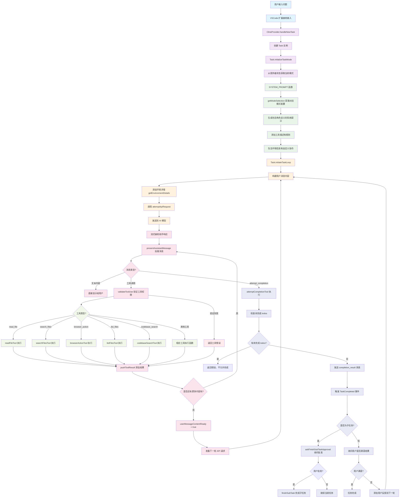

# Roo-Code Ask 模式完整流程图

## 详细流程图

## 流程说明

### 1. 用户输入阶段

- 用户在 VSCode 中输入问题
- VSCode 扩展接收输入并创建新任务

### 2. 任务初始化阶段

- `ClineProvider.handleNewTask` 处理新任务创建
- 创建 `Task` 实例并初始化模式
- `Task.initializeTaskMode` 从提供者状态获取当前模式
- **所有模式都会经过这个阶段，只是根据不同模式生成不同的配置**

### 3. 系统提示生成阶段

- `SYSTEM_PROMPT` 函数生成完整的系统提示
- `getModeSelection` 获取对应模式的配置信息
- 包含角色定义、可用工具、规则和环境信息
- **所有模式都会生成系统提示，只是内容根据模式不同而不同**

### 4. API 请求处理阶段

- `Task.initiateTaskLoop` 开始任务循环
- 构建包含环境详情的用户消息
- 调用 `attemptApiRequest` 发送到 AI 模型

### 5. 流式响应处理阶段

- 流式接收 AI 模型的响应
- `presentAssistantMessage` 处理每个消息块

### 6. 消息内容处理

- **文本内容**: 直接显示给用户
- **工具调用**: 先验证工具权限，然后执行相应工具

### 7. 工具执行阶段

支持多种工具类型：

- `read_file`: 读取文件内容
- `search_files`: 搜索文件
- `browser_action`: 浏览器操作
- `list_files`: 列出目录内容
- `codebase_search`: 代码库搜索
- 其他工具...

### 8. 任务完成阶段

- `attemptCompletionTool` 处理任务完成
- 检查是否有未完成的 todos
- 发送完成结果消息
- 根据是否为子任务执行不同逻辑

## 关键设计特点

1. **统一处理**: 所有模式都经过相同的核心流程
2. **模式差异**: 通过系统提示和工具权限体现不同模式的差异
3. **工具验证**: 每个工具调用都经过权限验证
4. **流式处理**: 支持流式响应，提升用户体验
5. **错误处理**: 完善的错误处理和用户反馈
6. **状态管理**: 通过事件系统管理任务状态
7. **扩展性**: 支持自定义模式和 MCP 服务器

## 模拟执行流程

假设用户问："这个项目的 ask 模式是如何工作的？"

1. **输入处理**: 用户输入被接收，创建任务（可能是 ask 模式或其他模式）
2. **模式初始化**: 获取当前模式设置（可能是 ask 或其他模式）
3. **提示生成**: 根据当前模式生成相应的系统提示和工具配置
4. **API 调用**: 发送问题到 AI 模型
5. **响应处理**: AI 返回分析结果，可能调用工具读取相关代码
6. **工具执行**: 执行相应的工具获取信息（受模式权限限制）
7. **结果整合**: 将工具结果整合到最终回答中
8. **任务完成**: 用户满意后任务完成

这个流程确保了不同模式能够根据各自的权限和角色安全有效地处理任务，同时维护代码的安全性。
